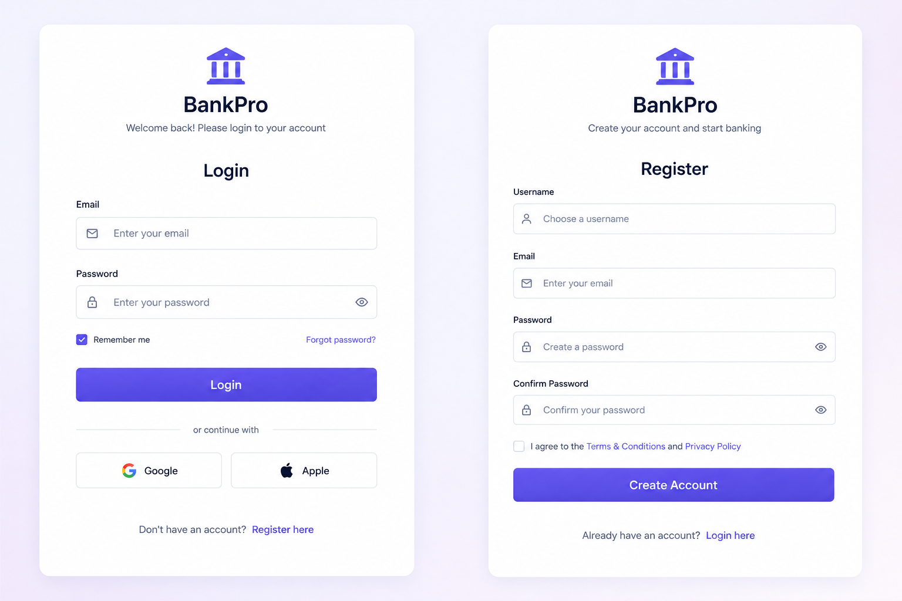
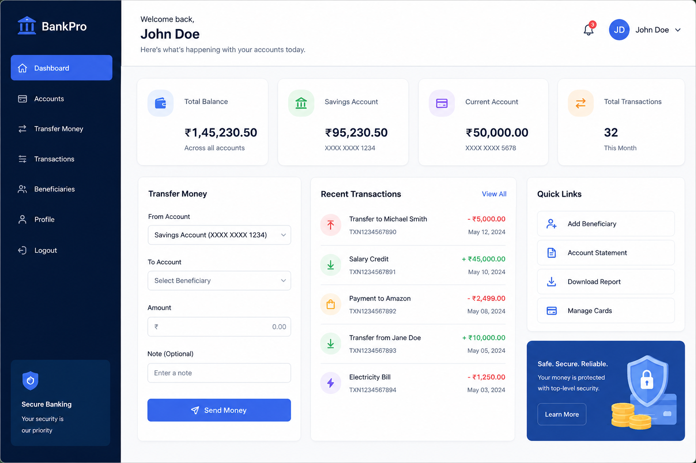
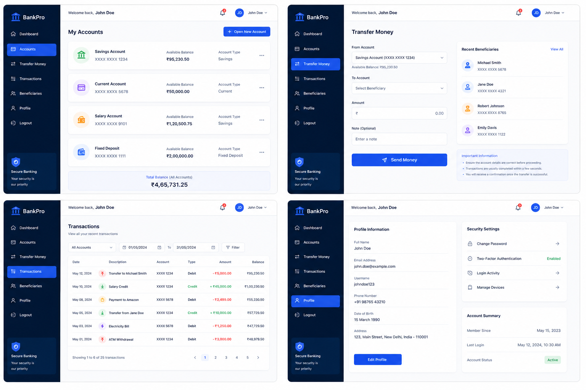

# 🏦 BankX

A full-stack banking application built with the MERN stack that enables users to create accounts, manage balances, transfer funds securely, and track transaction history in real time.

🌐 Live Demo: https://bank-x-two.vercel.app

🔗 Backend API: https://bankx-backend.onrender.com

---

## 📸 Screenshots

### Authentication



### Dashboard



### Banking Features



---

## ✨ Features

### Authentication

- User Registration
- User Login
- JWT Authentication
- HTTP Only Cookie Storage
- Persistent Login After Refresh
- Protected Routes

### Account Management

- Create Bank Account
- View Account Details
- Account Balance Tracking
- Unique Account Ownership

### Money Transfer

- Secure Fund Transfer
- Account Search Suggestions
- Recipient Selection
- Transaction Validation
- Idempotency Support

### Transactions

- View Transaction History
- Recent Transaction Preview
- Transfer Records
- Balance Updates

### User Experience

- Responsive UI
- Loading States
- Toast Notifications
- Real-Time Account Suggestions
- Modern Dashboard Design

### Email Services

- Nodemailer Integration
- Email Notifications

---

## 🛠️ Tech Stack

### Frontend

- React
- TypeScript
- Vite
- React Query (TanStack Query)
- React Hook Form
- React Router
- Axios
- Tailwind CSS

### Backend

- Node.js
- Express.js
- MongoDB Atlas
- Mongoose
- JWT Authentication
- Cookie Parser
- Nodemailer

### Deployment

- Frontend → Vercel
- Backend → Render
- Database → MongoDB Atlas

---

## 📂 Project Structure

```bash
BankX/
│
├── frontend/
│   ├── src/
│   │   ├── components/
│   │   ├── pages/
│   │   ├── context/
│   │   ├── hooks/
│   │   ├── services/
│   │   ├── features/
│   │   ├── types/
│   │   └── routes/
│   │
│   └── package.json
│
├── backend/
│   ├── src/
│   │   ├── configs/
│   │   ├── controllers/
│   │   ├── middlewares/
│   │   ├── models/
│   │   ├── routes/
│   │   ├── services/
│   │   ├── utils/
│   │   └── validators/
│   │
│   ├── server.js
│   └── package.json
│
└── README.md
```

---

## 🔐 Security Features

- JWT Authentication
- Protected API Routes
- HTTP Only Cookies
- Password Hashing using bcrypt
- Idempotent Transactions
- Input Validation
- Secure Environment Variables

---

## ⚙️ Installation

### Clone Repository

```bash
git clone https://github.com/sabhi-manu/BankX.git
```

```bash
cd BankX
```

---

### Backend Setup

```bash
cd backend
```

Install dependencies:

```bash
npm install
```

Create `.env`

```env
PORT=3000

MONGO_URI=your_mongodb_uri

JWT_SECRET=your_jwt_secret

EMAIL_USER=your_email

EMAIL_PASS=your_email_password
```

Start backend:

```bash
npm run dev
```

---

### Frontend Setup

```bash
cd frontend
```

Install dependencies:

```bash
npm install
```

Create `.env`

```env
VITE_API_URL=http://localhost:3000/api
```

Start frontend:

```bash
npm run dev
```

---

## 🚀 API Overview

### Authentication

```http
POST /api/auth/register
POST /api/auth/login
POST /api/auth/logout
GET  /api/auth/current-user
```

### Accounts

```http
POST /api/account/create
GET  /api/account
GET  /api/account/balance/:id
```

### Transactions

```http
POST /api/transaction/transfer
GET  /api/transaction/history
GET  /api/account/search
```

---

## 🔄 Transaction Flow

1. User logs in
2. Creates a bank account
3. Searches recipient account
4. Enters transfer amount
5. Transfer request is validated
6. Balance is updated
7. Transaction record is created
8. User can view transaction history

---

## 🎯 Future Improvements

- Savings & Current Account Types
- Beneficiary Management
- Transaction Analytics
- Monthly Reports
- Admin Dashboard
- Two Factor Authentication (2FA)
- Email Verification
- Account Statements PDF Export

---

## 👨‍💻 Author

**Sabhimanu Patel**

GitHub:
https://github.com/sabhi-manu

LinkedIn:
https://www.linkedin.com/in/sabhimanupatel

---

## ⭐ THANK YOU
